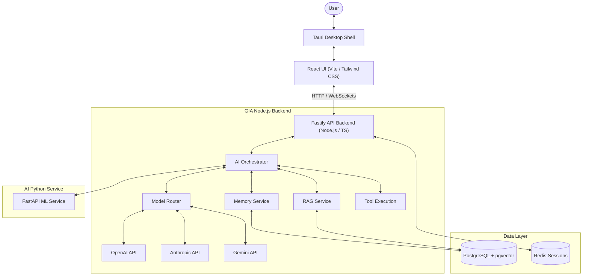

# GIA — System Architecture Reference

> **Version:** V1  
> **Status:** Active  
> **Document:** `ARCHITECTURE.md`  
> **Purpose:** Consolidated architectural source of truth for developer orientation and AI coding agents.

---

## 1. System Overview

GIA is a personal AI assistant built around stateful orchestration, semantic memory, document RAG, and desktop interactions. The system is designed to be highly modular, ensuring that intelligence engines (LLMs), capabilities (tools, retrievers), and application boundaries remain strictly decoupled.

### Core Data Flow & System Boundaries



---

## 2. Technology Stack

### Frontend & Client Shell
*   **Runtime:** [Tauri](file:///home/jasin/Desktop/GIA-AI/frontend/src-tauri) (Rust-backed desktop integration shell)
*   **UI Library:** React with TypeScript, styled using Tailwind CSS
*   **Bundler:** Vite
*   **State & Services:** Client-side HTTP/WebSocket API interfaces

### Backend API Service
*   **Runtime & Framework:** Node.js + Fastify + TypeScript
*   **AI Integration:** LangChain (LLM wrappers, tools) & LangGraph (stateful orchestrator workflows)
*   **Database Client:** PostgreSQL client (`pg`) with vector support (`pgvector`)
*   **Session Store:** Redis (for stateful authorization token cache)

### AI Python Service
*   **Framework:** FastAPI + Python (for specialized ML, formatting, and auxiliary tooling tasks)
*   **Test Runner:** pytest

---

## 3. Directory & Module Structure

The GIA workspace is organized as a monorepo containing three core services:

```text
GIA-AI/
├── backend/                  # Core Node.js Fastify Application
│   ├── src/
│   │   ├── ai/               # Multi-LLM provider wrappers & model routing
│   │   ├── api/              # Controllers, HTTP routes, and middlewares
│   │   ├── auth/             # User auth & Redis session management
│   │   ├── config/           # Application environment setup
│   │   ├── conversations/    # Threads, history, and message logic
│   │   ├── database/         # Database client pools and table schemas
│   │   ├── documents/        # RAG document parsing & processing
│   │   ├── memories/         # Short-term, Long-term, and Episodic memory
│   │   ├── rag/              # Document retrieval pipelines
│   │   └── shared/           # Common utilities
│   └── tests/                # Jest integration and unit tests
│
├── frontend/                 # React UI + Tauri desktop application wrapper
│   ├── src/                  # React views, assets, and service wrappers
│   └── src-tauri/            # Rust native shell configurations and capabilities
│
└── ai-service/               # Python ML API service
    ├── app/                  # FastAPI routers, models, services, and utils
    └── tests/                # python unit tests
```

---

## 4. Key Architectural Modules

### A. AI Orchestrator & Model Router
*   The **AI Orchestrator** is the hub for command execution. It decides the intent, determines context requirements, selects tools, and manages the execution loop (using LangGraph for complex workflows).
*   The **Model Router** abstracts downstream LLM providers (Gemini, OpenAI, Anthropic). It selects the most appropriate model dynamically based on criteria such as cost, latency, complexity, and window limits.

### B. Memory System
*   **Short-Term Memory:** Captures active conversational flow, task state, and recent context. Persisted in PostgreSQL.
*   **Long-Term Semantic Memory:** Extracts user facts, coding preferences, and long-standing setup details. Stored as vector embeddings in `pgvector` for semantic cosine similarity lookups.
*   **Episodic Memory:** Captures key high-level milestones or architectural decisions made by the user.

### C. Retrieval-Augmented Generation (RAG)
*   Ingests, parses, chunks, and embeds documents.
*   Retrieves document chunks using pgvector and performs re-ranking to construct the final grounding context for LLM execution. Keep RAG data isolated from the user's Long-Term Memory database.

---

## 5. Architectural Invariants (Golden Rules)

1.  **No Provider Lock-In:** Keep all vendor-specific SDK usage isolated within the provider layer under [ai/providers/](file:///home/jasin/Desktop/GIA-AI/backend/src/ai/providers). Do not hardcode provider names.
2.  **Modular Monolith:** Maintain the backend as a single service with distinct, modular folders (V1 does not support arbitrary microservices).
3.  **No Frontend AI Logic:** All model configuration, prompt composition, tool definitions, and memory operations must happen on the backend.
4.  **Database Decoupling:** Keep database query logic separate from routes/controllers; retrieve data through dedicated services or repository abstractions.
5.  **Strict Security Boundaries:** Secrets (such as API keys) must never be transmitted or exposed to the frontend browser or client shell.
